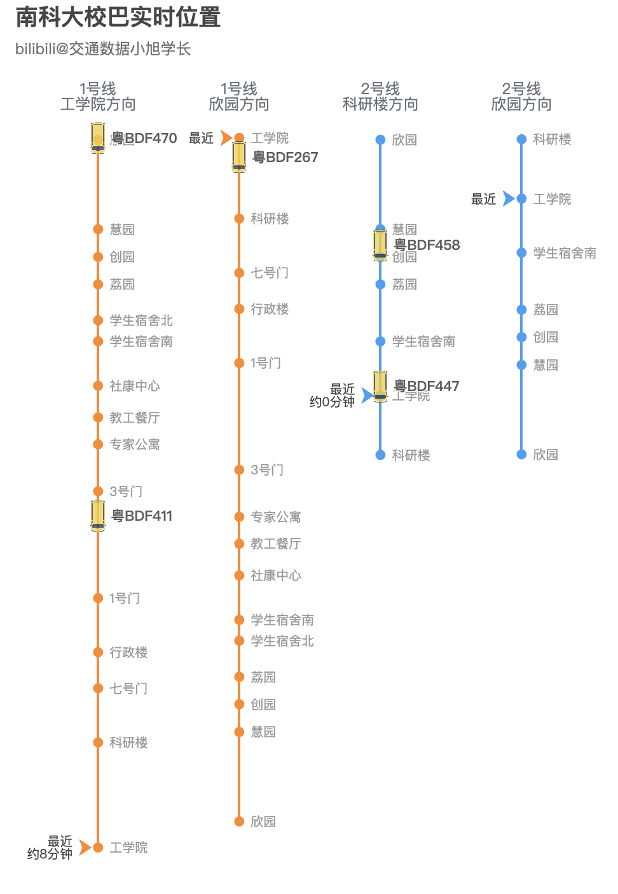

# 南科大校巴实时位置

基于公交GPS数据实时推测车辆所在位置，[点此访问](https://ni1o1.github.io/nikebus/)

## 原理

接入实时公交GPS，将车辆位置与公交线进行GIS空间匹配，并用ECharts的折线图、散点图进行绘制与标注

## 用什么做的？

编程语言JavaScript

- 前端框架：[React.js](http://reactjs.org)
- 图表绘制：[ECharts](https://echarts.apache.org/)
- 空间计算：[Turf.js](http://turfjs.org/)
